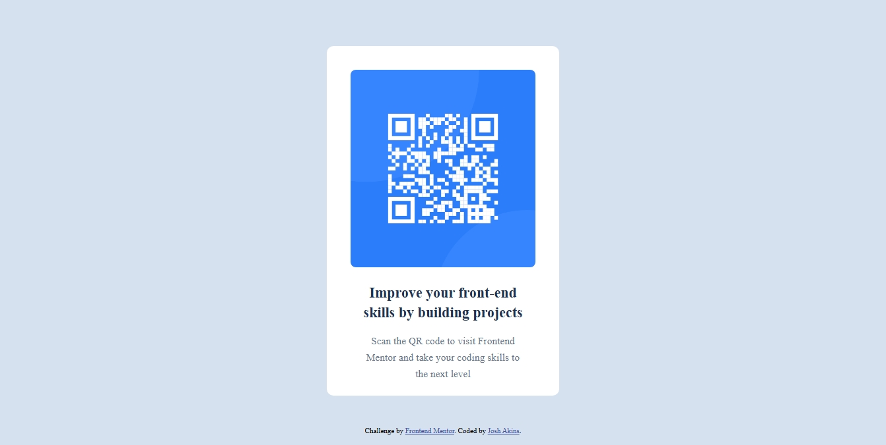
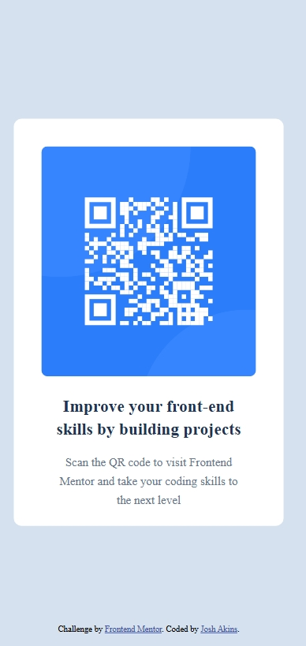

# Frontend Mentor - QR code component solution

This is a solution to the [QR code component challenge on Frontend Mentor](https://www.frontendmentor.io/challenges/qr-code-component-iux_sIO_H). Frontend Mentor challenges help you improve your coding skills by building realistic projects. 

## Table of contents

- [Overview](#overview)
  - [Screenshot](#screenshot)
  - [Links](#links)
  - [Built with](#built-with)
  - [What I learned](#what-i-learned)
  - [Continued development](#continued-development)
  - [Useful resources](#useful-resources)
  - [AI Collaboration](#ai-collaboration)
- [Author](#author)

## Overview

### Screenshot

### Links

- Solution URL: [Add solution URL here](https://your-solution-url.com)
- Live Site URL: [Add live site URL here](https://your-live-site-url.com)

### Built with

- Semantic HTML5 markup
- Internal CSS
- Flexbox
- Mobile-first workflow

### What I learned

I learnt more about flex properties while trying to center my card within the body element, I gained more knowledge on display positions properties while trying to reposition my footer to the bottom position

### Continued development

I will continue to deepen my understanding of flexbox properties and display properties as they power most responsive website displays and alignment at different display screens

### Useful resources

- While working on the cQA challenge and noticed some changes I couldn't explain how the changes i made in my code made it happen, I basically just Google it and find useful explanations with the Google AI resource 

### AI Collaboration

I used AI tools like Google AI search result to get detailed explanation on code snippet that I don't fully get how they work and it provides detailed explanation.

## Author

- Website - [Josh Akins](https://www.your-site.com)
- Frontend Mentor - [@josh-akins](https://wwww.frontendmentor.io/profile/josh-akins)
